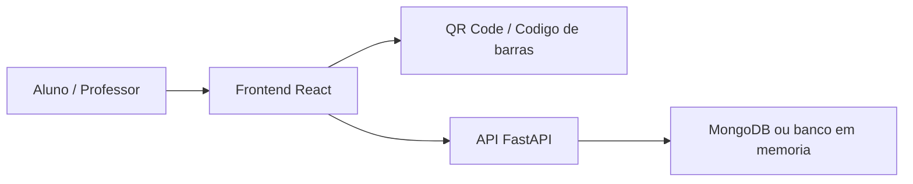

# Logi3A Solucoes Educacionais

Aplicacao educacional para organizar materiais, atividades, leitura de codigos e acompanhamento de aprendizagem em ambiente web.

## Visao Geral

O projeto combina frontend React com backend FastAPI para apoiar rotinas educacionais. A estrutura do repositorio indica telas para aluno, professor, materiais, historico, dashboard, geracao/leitura de QR Code e codigo de barras.

## Problema Resolvido

Instituicoes, professores ou equipes de treinamento precisam organizar materiais e acompanhar interacoes dos alunos de forma simples. Este projeto propõe uma experiencia web para centralizar conteudos, leituras, atividades e estatisticas em um unico fluxo.

## Beneficios

- Centraliza materiais e atividades em uma interface web.
- Apoia acompanhamento de alunos e professores.
- Usa QR Code e codigo de barras para conectar materiais fisicos ou identificadores digitais ao sistema.
- Facilita consultas de historico e estatisticas.

## Principais Funcionalidades

### Funcionalidades Disponiveis

- Cadastro e login de usuarios.
- Paineis para aluno e professor.
- Gestao de materiais.
- Geracao e leitura de QR Code.
- Leitura de codigo de barras.
- Registro de atividades e leituras.
- Dashboard e historico.
- Backend com suporte a MongoDB e banco em memoria para desenvolvimento local.

### Funcionalidades Planejadas

- Nao ha roadmap publico consolidado no conteudo atual.

## Como Funciona

```text
Usuario acessa a plataforma
-> realiza login
-> consulta ou gerencia materiais
-> usa leitura de QR Code ou codigo de barras
-> atividades e leituras sao registradas
-> dashboards e historicos apoiam o acompanhamento
```

## Tecnologias Utilizadas

- Python
- FastAPI
- MongoDB
- React
- JavaScript
- Tailwind CSS
- html5-qrcode
- qrcode.react

## Arquitetura



## Estrutura Do Projeto

- `frontend/`: interface web, paginas, componentes e contexto da aplicacao.
- `backend/`: API, rotas, uploads e dependencias Python.
- `memory/` e `test_reports/`: artefatos de acompanhamento do projeto.
- `tests/`: estrutura auxiliar de testes.

## Status

Projeto educacional em desenvolvimento/manutencao. O conteudo atual confirma estrutura funcional, mas nao confirma uso em producao.

## Minha Participacao

Desenvolvimento e organizacao de uma solucao educacional com foco em experiencia web, automacao de leitura por codigos e acompanhamento de atividades.

## Autor

Desenvolvido por Michele Santana — Kalion Tecnologia
